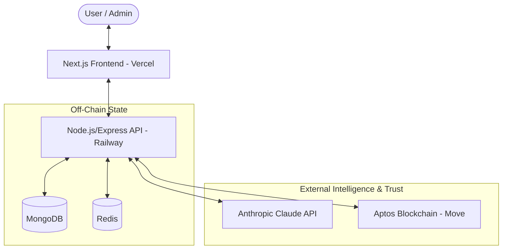

# 🏛️ CivicNode

### **AI-Powered Community Governance Platform**
*Decentralized Consensus & Treasury Management for Community Organizing*

Built for **Ghana**. Powered by **Anthropic Claude**. Secured by **Move Smart Contracts**.

---

## 📌 Overview

**CivicNode** replaces the friction of traditional community administration with an automated, trustless governance pipeline. It is designed to solve the compounding failures of participation fatigue, administrative bottlenecks, and financial opacity in local associations, cooperatives, and student groups across West Africa.

### 🚀 The Problem
Community organizing often gets trapped in fragmented WhatsApp/Discord debates with no clear audit trail or transparent resource allocation. This leads to disengagement and a lack of trust in financial disbursements.

### 💡 The Solution
CivicNode uses **AI to synthesize unstructured debate** into formal proposals, **blockchain voting** for tamper-proof democracy, and **smart contracts** for automatic treasury execution.

> [!IMPORTANT]
> **Core Principle**: The AI does not decide. It acts as a hyper-efficient secretary—synthesizing information so human members can focus on deliberation and collective connection.

---

## ✨ Core Features

| Feature | Description | Status |
| :--- | :--- | :--- |
| **🔐 Wallet-Based Auth** | Secure sign-in using Aptos-compatible wallets (EIP-4361 adapted). | `P0` |
| **🤖 AI Synthesis Engine** | Transforms raw chat logs (.txt, WhatsApp) into formal JSON proposals via Claude 3.5 Sonnet. | `P0` |
| **🗳️ On-Chain Voting** | Tamper-proof YES/NO/ABSTAIN voting using Move smart contracts on Aptos. | `P0` |
| **💰 Automated Treasury** | Collective treasury that only disburses funds upon passed proposals. | `P0` |
| **📊 Audit Trail** | Full transparency of past transactions, vote history, and proposal rationales. | `P0` |
| **👥 Role System** | Granular permissions for Admin, Member, and Observer roles. | `P0` |

---

## 🏗️ Technical Architecture

CivicNode is a three-tier system designed for scalability and transparency.



### **Tech Stack**
- **Frontend**: Next.js 14, React Context, SWR, Aptos SDK.
- **Backend**: Node.js, Express, JWT, SSE (for AI streaming).
- **Storage**: MongoDB Atlas, Redis (Rate limiting).
- **Intelligence**: Anthropic Claude 3.5 Sonnet (Structured Extraction).
- **Blockchain**: Aptos (Move Language).

---

## 👥 The Founding Team

| Name | Role | Core Focus |
| :--- | :--- | :--- |
| **Austin Bediako** | Product & Fullstack API | Vision, CI/CD, Backend API (Node/Express), Prompt Engineering, Anthropic Service. |
| **Nana Asiamah** | Research, Quality & Move | Feature Spec, User Research, Member Management UI, Move Smart Contracts (Aptos), Unit Testing. |
| **Joseph Gyimah** | Growth, Ops & Infra | Community Partnerships, Landing Page, Infrastructure (Railway/Vercel), DevOps, Cron Jobs. |

---

## 🛠️ Getting Started

### **Prerequisites**
- **Node.js**: v20 LTS
- **pnpm**: 8+
- **Docker**: For local MongoDB & Redis
- **Aptos CLI**: 3.x

### **Local Setup**

1. **Clone & Install**
   ```bash
   git clone https://github.com/kaeytee/civicnode
   cd civicnode
   pnpm install
   ```

2. **Environment Configuration**
   Copy `.env.example` in both `apps/api` and `apps/web` to `.env.local` and fill in:
   - `ANTHROPIC_API_KEY`
   - `APTOS_PRIVATE_KEY`
   - `MONGODB_URI`
   - `REDIS_URL`

3. **Run services**
   ```bash
   # Start DB and Cache
   docker-compose up -d
   
   # Start Frontend & Backend
   pnpm dev
   ```

4. **Verify**
   - Frontend: `http://localhost:3000`
   - Backend Health: `http://localhost:4000/health`

---

## 🚀 Development Workflow

### **Branching Strategy**
- `main`: Production (Protected)
- `dev`: Integration branch
- `feature/*`: New features
- `fix/*`: Bug fixes
- `contract/*`: Move-specific changes

### **Commit Format**
`type(scope): short description` (e.g., `feat(auth): add wallet signature verification`)

---

## 🗺️ Milestones

- [x] **Phase 1**: Wallet-sign in, Move module on devnet.
- [ ] **Phase 2**: Chat log upload & AI synthesis streaming.
- [ ] **Phase 3**: Full voting cycle & treasury disbursement.
- [ ] **Phase 4**: Mainnet deployment & Demo Day ready.

---

### 📞 Contact & Support
For any questions, reach out to the founding team or visit the [CivicNode Dashboard](https://civicnode.app).

*CivicNode — For the community, by the community.*
